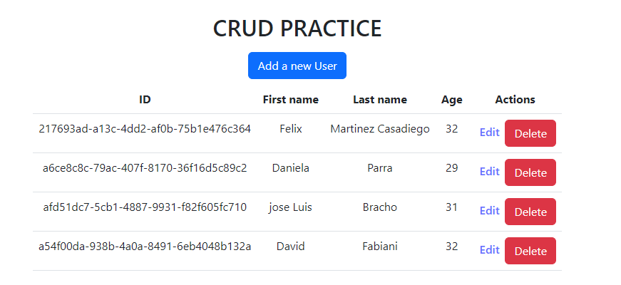
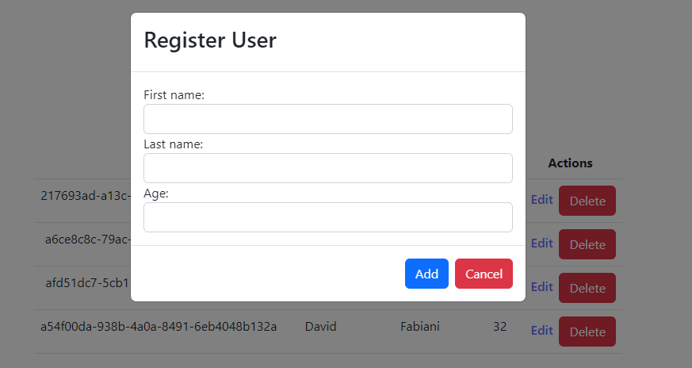
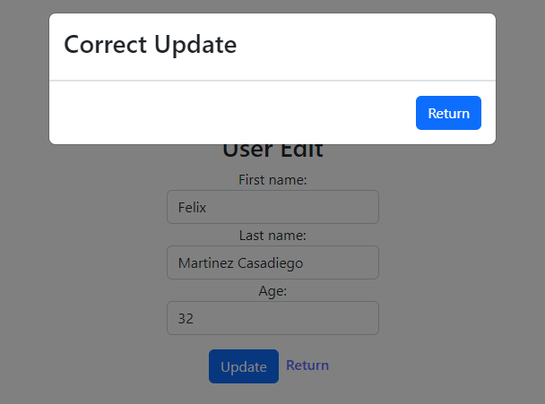
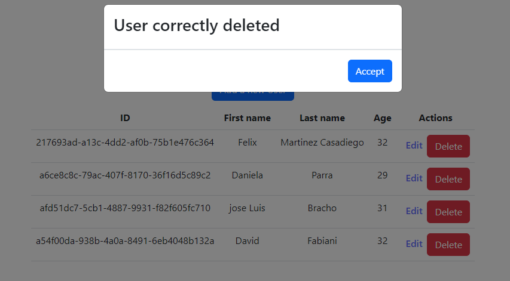

# Users CRUD

This repository is about a CRUD where you can create, delete and edit the users.

## Description

I used for the creation Typescript, React-router-dom, Bootstrap and Axios.

The Api Rest used is one that I created, this with the objective of creating an interaction with the backend.

## Screenshots

### Register

### Edit

### Delete

